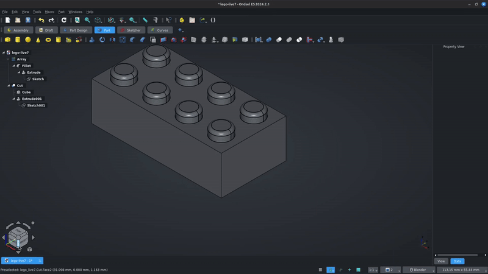
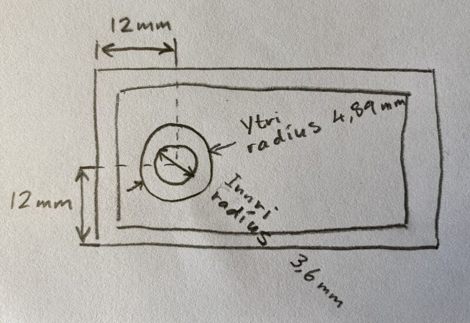
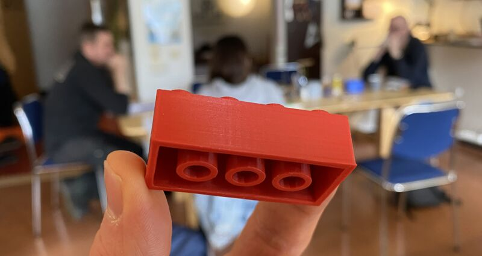

# Ondsel kennsla

## Fyrirmæli

Á Fab Lab Ísland fundinum miðvikudaginn 18. september teiknuðum við LEGO kubb. 

Við komumst svona langt saman:

Eins og [LEGO heimildarmyndin sýnir](https://youtu.be/qr_dTySMl7s?si=GOWY0GLPucYDNKjk&t=695) (vinsælt myndband á mínu heimili) þá voru fyrstu LEGO kubbarnir svona, en þeir héldust ekki nógu vel saman. Galdurinn, og kjarninn í LEGO einkaleyfinu, er rörin sem eru undir kubbnum. Ég vil að þið teiknið eitt rör í Part workbench og farið síðan í Draft workbench og gerið Array með 12 mm bili á milli röra.

Hér eru málin á rörinu:

Hér er ég búinn að þrívíddarprenta eitt stykki:

Hvernig teiknar maður eiginlega rörin? 
- Ein leið er að fara í Sketcher workbench og gera nýja skissu á yfirborðið inni í kubbnum (eða á XY planið). Teikna tvo hringi með sömu miðju og málsetja. Loka síðan skissunni, fara í Part workbench og gera extrude. Hversu langt? Hæð kubbsins mínus veggþykktin (14,4mm - 1,8mm).
- Önnur leið er að búa til Tube með sömu aðferð og við bjuggum til Cube í byrjun (gulu grunnformin í Part workbench). Þegar þið eruð komin með rör á skjáinn þá getið þið valið Tube í trénu vinstra megin og stillt stærð og staðsetningu þess í Property View. Munið þið eftir Property View?

## Góðar stillingar í Ondsel

- Ég mæli með að [stilla músina svona](https://github.com/user-attachments/assets/92cc200b-430b-4a10-b6b7-a378fe45ee48).
- Þið fáið upp [Property View panel svona](https://github.com/user-attachments/assets/acdf3e7a-a5ee-46e7-9fee-77053b6b4a6a).

## Þrívíddarprentun

Ef þú ætlar að þrívíddarprenta kubbinn þá þarftu að sameina allt í einn hlut og breyta honum í STL. 

1. Þú velur marga hluti í trénu með því að halda inni Ctrl. Þetta ættu að vera tvö Array og eitt Cut. 
2. Síðan gerirðu Union í Part workbench (stundum kallað [Part_Fuse](https://wiki.freecad.org/Part_Fuse)). 
3. Að lokum velurðu kubbinn og ferð í File -> Export.
4. Þá kemur upp gluggi til að gefa exportaða módelinu nafn. Undir nafninu skaltu velja STL.